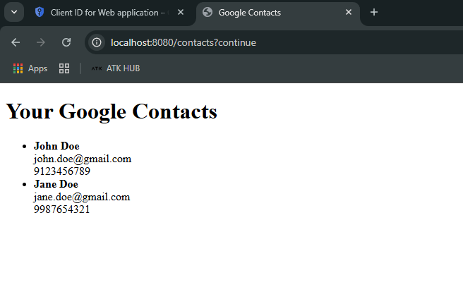

# Google Contacts Integration – View-Only Access

### Project Information:
**Course**: IT342 - System Integration

**Student**: MANGUBAT, Aldrin R.

**Tech Stack**: Java, Spring Boot, Thymeleaf, Google People API

▔▔▔▔▔▔▔▔▔▔▔▔▔▔▔▔▔▔▔▔▔▔▔▔▔▔▔▔▔▔▔▔▔▔▔▔

### Objectives:
* Authenticate a user with their Google account using OAuth 2.0.

* Fetch the user’s contacts (read-only) from the Google People API.

* Display each contact’s Name, Email, and Phone Number.

▔▔▔▔▔▔▔▔▔▔▔▔▔▔▔▔▔▔▔▔▔▔▔▔▔▔▔▔▔▔▔▔▔▔▔▔

### Summary:
**1. Google Cloud Console**
   * Created a new project
   * Enabled Google People API
   * Created OAuth 2.0 Credentials (Client ID and Secret)
   * Configured the OAuth consent screen:
   * App name and support email
   * Added scope: https://www.googleapis.com/auth/contacts.readonly
   * Added test user (my Google account)

**2. Spring Boot Backend**
* Added dependencies:
   * spring-boot-starter-oauth2-client
   * spring-boot-starter-thymeleaf
   * spring-boot-starter-web
* Configured application.properties for OAuth2 settings
* Implemented a GoogleController to:
    * Handle login
  * Use access token to request /v1/people/me/connections
  * Request personFields=names,emailAddresses,phoneNumbers

**3. Thymeleaf Frontend**
* Basic HTML to:
    * Display login page if unauthenticated
  * Render list of contacts once logged in
  * Show name, email, and phone number

**4. Testing**
   * App launches successfully
   * OAuth login flow works
   * Contacts are displayed as expected

▔▔▔▔▔▔▔▔▔▔▔▔▔▔▔▔▔▔▔▔▔▔▔▔▔▔▔▔▔▔▔▔▔▔▔▔
### Screenshot (Contact Display)

▔▔▔▔▔▔▔▔▔▔▔▔▔▔▔▔▔▔▔▔▔▔▔▔▔▔▔▔▔▔▔▔▔▔▔▔

### Note:
* If no contacts appear, ensure your Gmail account has at least **1 contact** saved in Google Contacts.